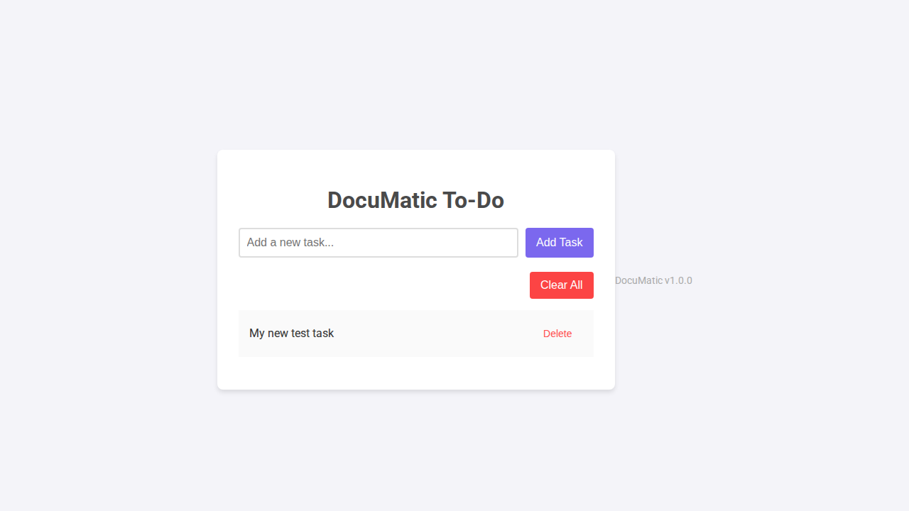

# DocuMatic - User Guide (v1.0.0)

Welcome to DocuMatic! This guide will help you get started with managing your tasks.

## Features
- Adding new tasks
- Deleting existing tasks
- Simple and clean user interface

## Adding a Task

To add a new task, simply type your task into the input field at the top of the application and click the "Add Task" button.

Here's an example of the app after adding a task:

That's it! Your task is now added to the list.