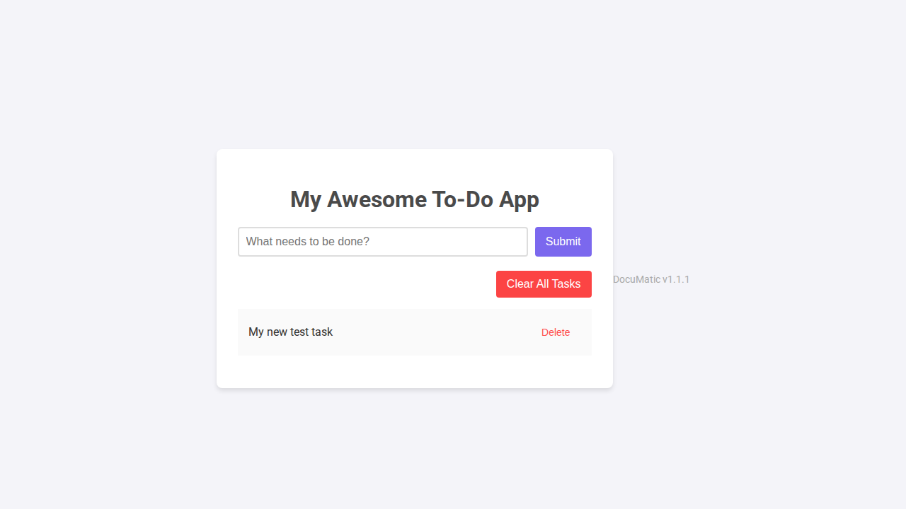
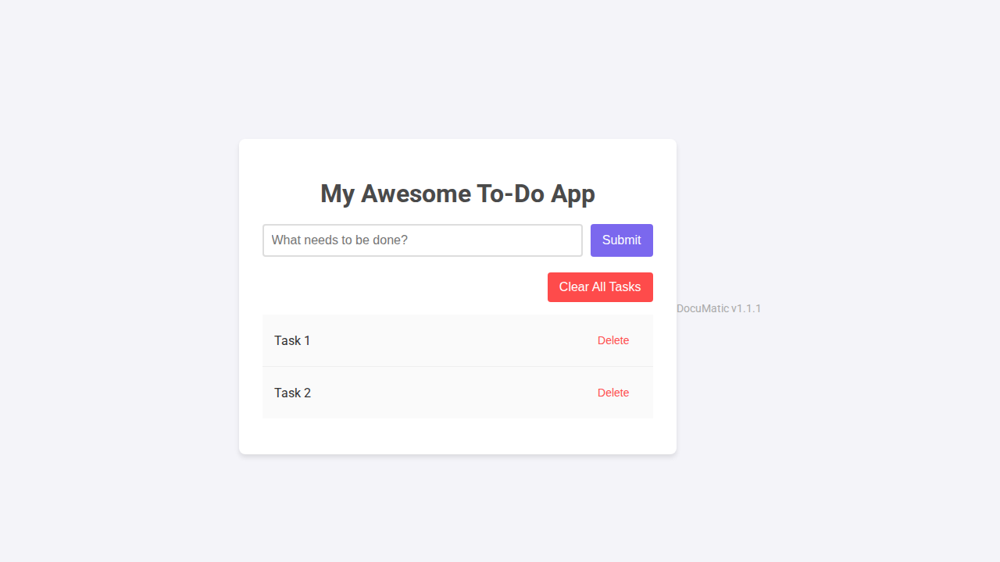

# DocuMatic - User Guide (v1.2.2)

Welcome to DocuMatic! This guide will help you get started with managing your tasks.

## Features
- Create a new task
- Delete a task
- Clear all tasks at once

## Adding a Task

To add a new task, simply type your task into the input field at the top of the application and click the "Add Task" button.

Here's an example of the app after adding a task:

## Clearing All Tasks

You can remove all tasks from your list at once by clicking the "Clear All" button, located at the top-right of the task list.

Here's what the application looks like with a few tasks before clearing them:

That's it!