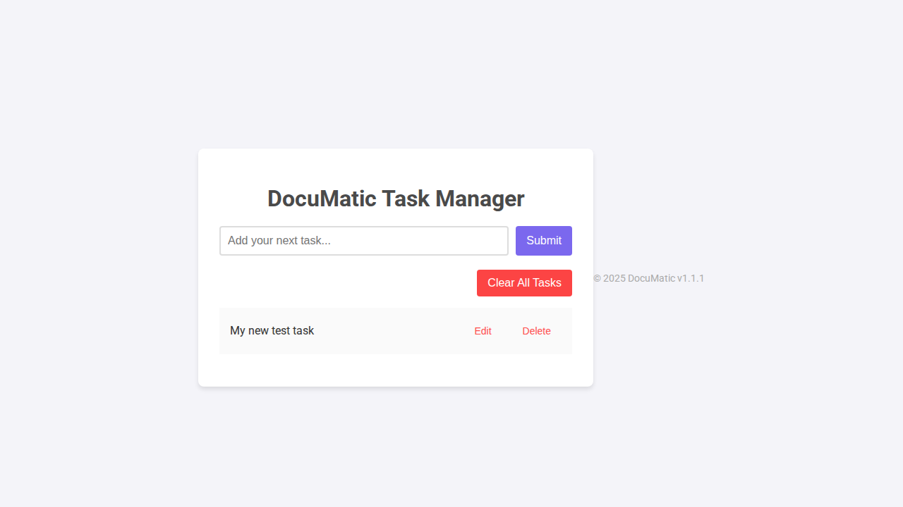
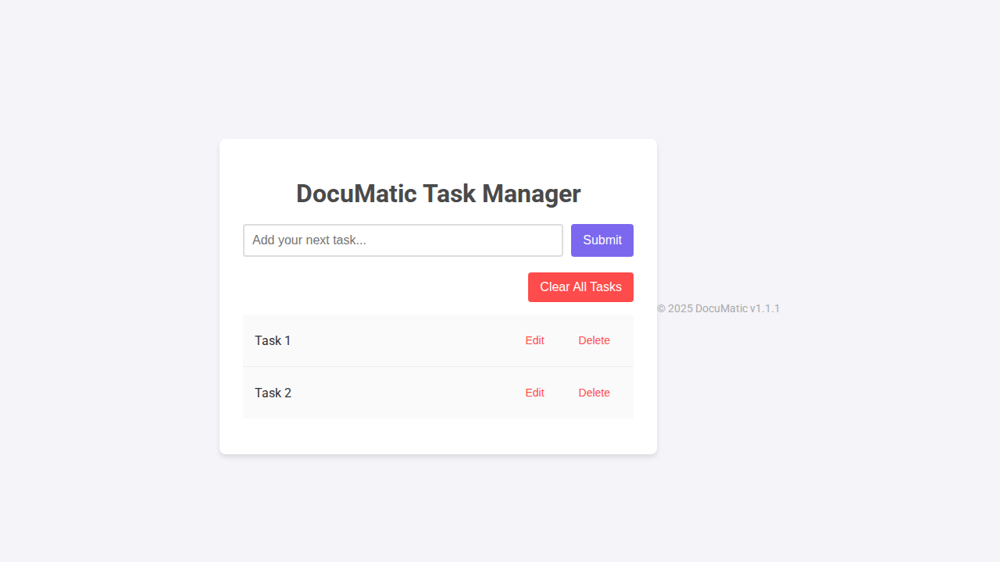

# DocuMatic - User Guide (v1.5.1)

Welcome to DocuMatic! This guide will help you get started with managing your tasks.

## Features
- Create a new task
- Delete a task
- Clear all tasks at once
- Edit an existing task

## Adding a Task

To add a new task, simply type your task into the input field at the top of the application and click the "Add Task" button.

Here's an example of the app after adding a task:

## Clearing All Tasks

You can remove all tasks from your list at once by clicking the "Clear All" button, located at the top-right of the task list.

Here's what the application looks like with a few tasks before clearing them:

## Editing a Task

You can edit an existing task by clicking the "Edit" button. This will turn the task into an input field where you can make changes. Click "Save" to update the task.

Here is a task that has been successfully edited:

That's it!